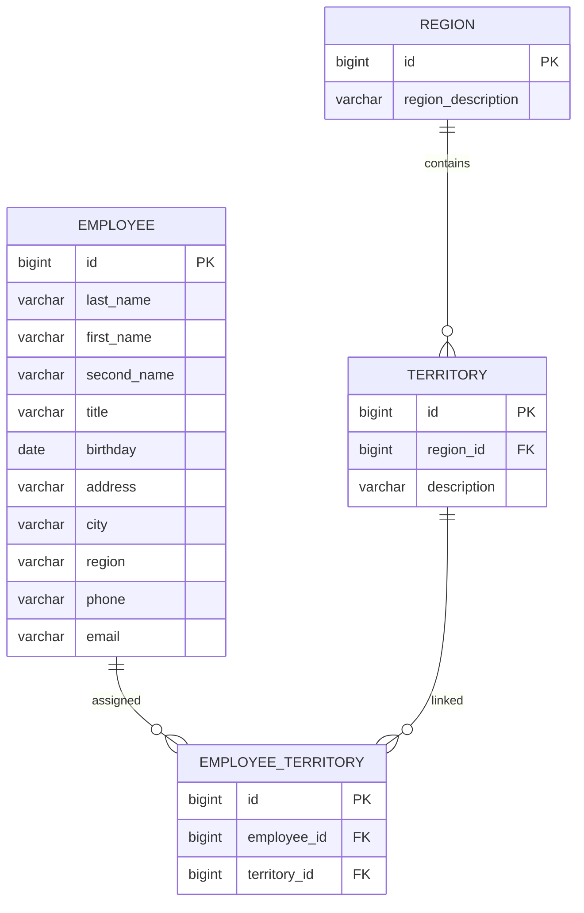

# Титульный лист

МИНИСТЕРСТВО НАУКИ И ВЫСШЕГО ОБРАЗОВАНИЯ  
РОССИЙСКОЙ ФЕДЕРАЦИИ  
ФГБОУ ВО «РОСТОВСКИЙ ГОСУДАРСТВЕННЫЙ ЭКОНОМИЧЕСКИЙ  
УНИВЕРСИТЕТ (РИНХ)»  
ФАКУЛЬТЕТ КОМПЬЮТЕРНЫХ ТЕХНОЛОГИЙ  
И ИНФОРМАЦИОННОЙ БЕЗОПАСНОСТИ  
Кафедра информационных систем и прикладной информатики  

КУРСОВОЙ ПРОЕКТ  
по дисциплине «Разработка и сопровождение программных систем»  

**Тема:** «Информационная подсистема формирования данных о региональных представителях фирмы»

Выполнил: студент группы ПИZS-321  
Ординян А. С.  

Руководитель курсового проекта: ____________________  

Ростов-на-Дону, 2026

---

# Задание на курсовой проект

Согласно индивидуальному заданию студент Ординян А. С. выполняет курсовой проект по варианту 14 «Информационная подсистема формирования данных о региональных представителях фирмы».  
Необходимо разработать Java-приложение на базе платформы Java EE, реализующее веб-интерфейс для ведения моделей данных, хранение информации в PostgreSQL, средства аутентификации пользователей, защиту веб-запросов и безопасность на уровне методов, а также модульные и интеграционные тесты.

В состав проекта входят:

1. главная страница веб-приложения;
2. страницы просмотра, добавления, редактирования и удаления данных;
3. база данных и ее тестовое наполнение;
4. контроллеры, сервисы и средства доступа к данным;
5. механизмы разграничения прав;
6. пояснительная записка по курсовому проекту.

---

# Содержание

1. Введение  
2. Анализ предметной области  
3. Проектирование базы данных  
4. Проектирование веб-приложения  
5. Тестирование и эксплуатация  
6. Заключение  
7. Список литературы  
8. Приложения  

---

# Введение

Для компаний, имеющих широкую сеть региональных представителей, особое значение приобретает централизованное хранение сведений о сотрудниках, закрепленных территориях и территориальной принадлежности городов и областей. Использование несвязанных таблиц и разрозненных файлов приводит к дублированию данных, ошибкам при распределении зон ответственности и затрудняет оперативное обновление информации.

Автоматизация процесса формирования и ведения данных о региональных представителях позволяет обеспечить актуальность сведений о сотрудниках, их контактной информации и закрепленных территориях, а также повысить управляемость региональной сети фирмы.

Цель курсового проекта заключается в проектировании веб-приложения для учета региональных представителей фирмы, основанного на реляционной базе данных PostgreSQL и реализованного на Java-технологиях.

Для достижения цели необходимо:

1. проанализировать предметную область и состав сущностей варианта;
2. спроектировать логическую и физическую модели данных;
3. определить архитектуру веб-приложения и состав пользовательских страниц;
4. описать механизмы аутентификации, авторизации и тестирования;
5. подготовить SQL-скрипты для создания и наполнения базы данных.

Объектом исследования является процесс учета региональных представителей фирмы.  
Предметом исследования выступают методы проектирования базы данных и серверного веб-приложения для автоматизации данного процесса.

---

# 1 Анализ предметной области

## 1.1 Назначение подсистемы

Вариант 14 включает модели `Employee`, `Region`, `Territory` и `EmployeeTerritory`. Подсистема предназначена для ведения сведений о сотрудниках, отвечающих за работу в определенных областях и городах, а также для хранения структуры территориального закрепления.

Система должна поддерживать следующие практические задачи:

1. хранение личных и контактных данных региональных представителей;
2. ведение справочника областей;
3. ведение справочника городов и привязка их к областям;
4. закрепление одного или нескольких городов за сотрудником;
5. поиск представителя по области, городу, должности или фамилии;
6. исключение дублирования сведений о территориях.

## 1.2 Пользователи и их функции

Предлагается выделить три категории пользователей:

| Роль | Доступные действия |
| --- | --- |
| `ADMIN` | Полный доступ ко всем разделам, настройка пользователей |
| `HR_MANAGER` | Работа с сотрудниками, территориями и назначениями |
| `VIEWER` | Просмотр данных без права изменения |

Функции роли `HR_MANAGER` являются основными с точки зрения предметной области. Такой пользователь должен иметь возможность:

1. создать карточку сотрудника;
2. изменить контактные данные;
3. добавить новую область;
4. создать запись о городе;
5. связать сотрудника с одной или несколькими территориями;
6. удалить ошибочную связь или неактуальную запись.

## 1.3 Функциональные требования

На основании задания и модели варианта формулируются следующие функциональные требования:

1. главная страница с разделами «Сотрудники», «Области», «Города», «Назначения»;
2. список сотрудников с выводом ФИО, должности, города, телефона и электронной почты;
3. карточка сотрудника с возможностью добавления и редактирования данных;
4. отдельные страницы для ведения областей и территорий;
5. форма назначения территории сотруднику;
6. фильтрация сотрудников по области и городу;
7. удаление связей между сотрудниками и территориями;
8. аутентификация пользователей и защита закрытых разделов системы;
9. тестирование контроллеров, сервисов и взаимодействия с базой данных.

## 1.4 Особенности исходной модели

Модель варианта содержит поле `Region` у сотрудника и отдельную сущность `Region`. Для исключения логических противоречий в физической схеме используются два уровня представления:

1. поле `employee.region` хранит текстовую информацию о регионе, указанную в карточке сотрудника;
2. таблица `region` используется как нормализованный справочник областей, применяемый для привязки территорий.

Это решение сохраняет совместимость с постановкой варианта и одновременно позволяет строить нормализованные связи между городами и областями.

## 1.5 Бизнес-сценарии

Ключевые сценарии эксплуатации системы выглядят следующим образом:

1. специалист отдела кадров входит в систему и открывает список сотрудников;
2. при приеме нового представителя вносится его карточка с персональными данными;
3. в справочник добавляется новая область и относящиеся к ней города;
4. сотруднику назначается территория обслуживания;
5. руководитель просматривает, какой сотрудник закреплен за конкретным городом;
6. при изменении распределения зон ответственности старая привязка удаляется, а новая создается.

---

# 2 Проектирование базы данных

## 2.1 Логическая модель

Логическая структура данных включает четыре основные сущности:

| Сущность | Назначение |
| --- | --- |
| `Employee` | Хранение сведений о региональном представителе |
| `Region` | Справочник областей |
| `Territory` | Справочник городов с привязкой к области |
| `EmployeeTerritory` | Таблица связей сотрудника с территориями |

С точки зрения нормализации схема соответствует третьей нормальной форме:

1. сведения об областях вынесены в отдельный справочник;
2. города связаны с областями отношением многие-к-одному;
3. связь сотрудников с территориями вынесена в отдельную таблицу, что позволяет поддерживать отношение многие-ко-многим;
4. дублирующие контактные сведения хранятся только в таблице сотрудников.

## 2.2 Описание таблиц

### Таблица `region`

| Поле | Тип | Ограничения | Назначение |
| --- | --- | --- | --- |
| `id` | `bigserial` | `PK` | Идентификатор области |
| `region_description` | `varchar(120)` | `NOT NULL`, `UNIQUE` | Наименование области |

### Таблица `territory`

| Поле | Тип | Ограничения | Назначение |
| --- | --- | --- | --- |
| `id` | `bigserial` | `PK` | Идентификатор территории |
| `region_id` | `bigint` | `FK`, `NOT NULL` | Ссылка на область |
| `description` | `varchar(120)` | `NOT NULL` | Наименование города |

### Таблица `employee`

| Поле | Тип | Ограничения | Назначение |
| --- | --- | --- | --- |
| `id` | `bigserial` | `PK` | Идентификатор сотрудника |
| `last_name` | `varchar(60)` | `NOT NULL` | Фамилия |
| `first_name` | `varchar(60)` | `NOT NULL` | Имя |
| `second_name` | `varchar(60)` | `NULL` | Отчество |
| `title` | `varchar(100)` | `NOT NULL` | Должность |
| `birthday` | `date` | `NOT NULL` | Дата рождения |
| `address` | `varchar(200)` | `NOT NULL` | Адрес |
| `city` | `varchar(100)` | `NOT NULL` | Город проживания |
| `region` | `varchar(100)` | `NOT NULL` | Регион проживания в текстовом виде |
| `phone` | `varchar(30)` | `NOT NULL`, `UNIQUE` | Телефон |
| `email` | `varchar(120)` | `NOT NULL`, `UNIQUE` | Электронная почта |

### Таблица `employee_territory`

| Поле | Тип | Ограничения | Назначение |
| --- | --- | --- | --- |
| `id` | `bigserial` | `PK` | Идентификатор назначения |
| `employee_id` | `bigint` | `FK`, `NOT NULL` | Ссылка на сотрудника |
| `territory_id` | `bigint` | `FK`, `NOT NULL` | Ссылка на территорию |

## 2.3 Схема связей



## 2.4 Ограничения целостности и индексация

Для поддержания качества данных вводятся следующие ограничения:

1. наименование области должно быть уникальным;
2. сочетание области и города не должно дублироваться;
3. телефон и электронная почта сотрудника должны быть уникальными;
4. связь одного сотрудника с одной и той же территорией не может повторяться;
5. электронная почта должна содержать символ `@`;
6. при удалении сотрудника или территории зависимые записи в таблице назначений удаляются каскадно.

Индексы создаются по полям:

1. `territory.region_id`;
2. `employee.city`;
3. `employee_territory.employee_id`;
4. `employee_territory.territory_id`.

Такая схема обеспечивает быстрый поиск сотрудников по городу и корректную работу таблицы назначений.

## 2.5 Скрипты БД

В комплект проекта включены:

1. `ddl.sql` с командами создания схемы, таблиц, индексов и ограничений;
2. `seed.sql` с тестовыми значениями областей, городов, сотрудников и назначений.

Скрипты позволяют оперативно развернуть учебную базу данных и проверить основные сценарии системы.

---

# 3 Проектирование веб-приложения

## 3.1 Выбор архитектурного подхода

Для реализации подсистемы предлагается классическая многослойная архитектура Java-веб-приложения. В качестве практического инструментария целесообразно использовать:

1. Java 21;
2. Spring Boot;
3. Spring Data JPA;
4. Spring Security;
5. Thymeleaf;
6. PostgreSQL;
7. JUnit 5, Mockito и Testcontainers.

Данный стек обеспечивает быстрый запуск учебного проекта и покрывает требования задания по безопасности, тестированию и работе с реляционной СУБД.

## 3.2 Слои приложения


Распределение обязанностей между слоями:

| Слой | Назначение |
| --- | --- |
| Представления | Отображение списков и форм |
| Контроллеры | Обработка HTTP-запросов |
| Сервисы | Бизнес-правила, валидация, проверка прав |
| Репозитории | Выполнение операций чтения и записи в БД |

## 3.3 Структура пользовательского интерфейса

Система должна включать следующие разделы:

1. главная страница;
2. список сотрудников;
3. форма создания и редактирования сотрудника;
4. список областей;
5. форма добавления области;
6. список территорий;
7. форма назначения территорий сотруднику;
8. страница входа в систему;
9. страница отказа в доступе.

Особое значение для пользователя имеют две страницы:

1. карточка сотрудника, где отображаются персональные данные и закрепленные территории;
2. реестр назначений, в котором видно, какой сотрудник отвечает за конкретный город.

Для иллюстрации реализованного интерфейса в отчете приведены скриншоты основных экранов системы. На рисунке 3.1 показана страница входа в систему, на рисунке 3.2 - главная страница приложения, а на рисунке 3.3 - список сотрудников с доступными действиями пользователя.


## 3.4 Правила валидации

При сохранении сотрудника и территориальных данных должны выполняться следующие проверки:

1. обязательное заполнение фамилии, имени, должности, адреса, города, региона, телефона и электронной почты;
2. корректный формат электронной почты;
3. уникальность телефона и адреса электронной почты;
4. наличие указанной области для каждой территории;
5. отсутствие повторной привязки одного и того же сотрудника к одной территории.

Часть этих ограничений реализуется на уровне интерфейса и сервисов, а часть на уровне базы данных.

## 3.5 Аутентификация и авторизация

В системе вводится ролевая модель безопасности:

1. `ADMIN` управляет всеми разделами;
2. `HR_MANAGER` создает и изменяет сотрудников, территории и назначения;
3. `VIEWER` имеет доступ только к просмотру списков и карточек.

Проверка доступа должна выполняться:

1. на уровне URL-маршрутов;
2. на уровне методов сервиса с использованием аннотаций;
3. на уровне шаблонов интерфейса для скрытия запрещенных действий.

Пример проверки:

```java
@PreAuthorize("hasAnyRole('ADMIN','HR_MANAGER')")
public EmployeeTerritoryDto assignTerritory(EmployeeTerritoryDto dto) {
    // сохранение назначения сотрудника на территорию
}
```

Такой подход исключает выполнение критичных операций пользователями с недостаточными правами.

---

# 4 Тестирование и эксплуатация

## 4.1 Модульное тестирование

Модульные тесты должны охватывать сервисы сотрудников, территорий и назначений. В рамках таких тестов проверяются:

1. создание сотрудника при корректных данных;
2. отклонение записи при дублирующемся адресе электронной почты;
3. создание новой территории в существующей области;
4. отклонение повторного назначения сотрудника на ту же территорию;
5. удаление назначения с корректным обновлением данных.

Пример перечня тестов:

| Тест | Предусловия | Ожидаемый результат |
| --- | --- | --- |
| Создание сотрудника | уникальный телефон и email | сотрудник сохраняется |
| Создание сотрудника с повторным email | email уже существует | ошибка валидации |
| Назначение территории | сотрудник и город существуют | связь сохраняется |
| Повторное назначение территории | такая связь уже есть | операция отклоняется |

## 4.2 Интеграционное тестирование

Интеграционные тесты проверяют работу приложения через HTTP-слой и взаимодействие с базой данных. Предлагается проверить:

1. вход в систему с валидными учетными данными;
2. успешную загрузку списка сотрудников после авторизации;
3. создание карточки сотрудника через веб-форму;
4. добавление города и области;
5. назначение города сотруднику;
6. запрет доступа к закрытым разделам для неавторизованного пользователя.

Применение Testcontainers позволяет запускать отдельный экземпляр PostgreSQL для каждого набора тестов и тем самым получать воспроизводимую среду.

## 4.3 Подготовка к эксплуатации

Перед запуском системы необходимо:

1. создать базу данных PostgreSQL;
2. выполнить `ddl.sql`;
3. выполнить `seed.sql`;
4. настроить параметры подключения в файле конфигурации приложения;
5. запустить сервер;
6. открыть приложение в браузере и пройти аутентификацию.

Для сопровождения системы рекомендуется:

1. вести резервное копирование базы данных;
2. контролировать актуальность контактных данных сотрудников;
3. периодически проверять корректность территориального закрепления;
4. журналировать административные изменения.

---

# 5 Заключение

Выполнено проектирование информационной подсистемы формирования данных о региональных представителях фирмы. Определены основные сущности предметной области, спроектирована структура базы данных, описаны пользовательские роли, функциональные возможности и подход к реализации защищенного веб-приложения.

Предложенная модель позволяет вести учет сотрудников, областей, городов и назначений территорий, поддерживает операции просмотра, добавления, редактирования и удаления данных, а также обеспечивает основу для последующей программной реализации на Java.

Подготовленные SQL-скрипты могут быть использованы для развертывания учебной базы данных и демонстрации ключевых сценариев работы системы в рамках курсового проекта.

---

# 6 Список литературы

1. Задание на курсовой проект. Локальный учебный материал кафедры.
2. Варианты моделей предметной области для курсового проекта. Локальный учебный материал кафедры.
3. Методические указания по оформлению курсового проекта. Локальный учебный материал кафедры.
4. Голицына О. Л., Максимов Н. В. Базы данных. Москва: Форум, 2021.
5. Шлее М. Разработка веб-приложений на Java. Санкт-Петербург: Питер, 2022.
6. PostgreSQL Documentation. Официальный ресурс проекта PostgreSQL.
7. Oracle Java Documentation. Официальная документация платформы Java.
8. JUnit 5 User Guide. Руководство по тестированию Java-приложений.

---

# 7 Приложения

## Приложение А. Скрипт создания базы данных

Полный текст вынесен в файл `ddl.sql`.

Ключевые таблицы:

```sql
create table region (...);
create table territory (...);
create table employee (...);
create table employee_territory (...);
```

## Приложение Б. Скрипт наполнения тестовыми данными

Файл `seed.sql` содержит:

1. справочник областей;
2. справочник городов;
3. тестовых сотрудников;
4. назначения сотрудников на территории.

## Приложение В. Пример сервиса назначения территорий

```java
@Service
@RequiredArgsConstructor
public class EmployeeTerritoryService {
    private final EmployeeTerritoryRepository repository;

    public EmployeeTerritory assign(EmployeeTerritory entity) {
        return repository.save(entity);
    }
}
```
